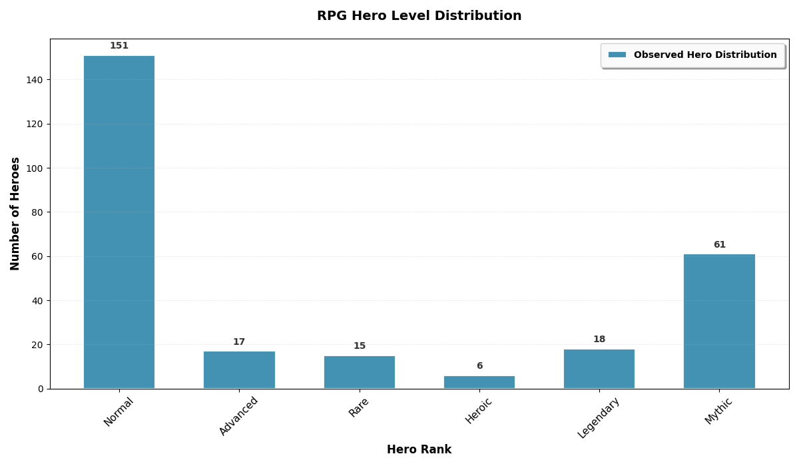

Consider this hero level statistics from an RPG game: instead of an expected bell-shaped distribution, we observe a 
bimodal distribution with high counts at both ends and a dip in the middle.

This pattern tells a compelling story about player psychology. Players tend to categorize heroes into two groups: meta 
heroes that they prioritize leveling up to maximum potential, and weak heroes that receive minimal investment. Each 
group follows its own normal distribution, and when combined, these two distributions create the bimodal pattern we 
observe.

This is precisely where Gaussian Mixture Models (GMM) come into play, a powerful statistical tool that allows us to 
model complex data as a combination of multiple Gaussian distributions, revealing hidden structures and patterns that 
single-distribution models would miss.

## Gaussian Mixture Models

### definition

$k$ components, $z$ is hidden state

$$
p(z = j) = \pi_j \\
\sum_{j = 1}^k \pi_j = 1
$$

$x$ is observation conditioned on $z$, Gaussian distribution

$$
p(x \mid z = j) = \mathcal{N}(x \mid \mu_j, \Sigma_j)
$$

together, the distribution is weighted sum

$$
p(x) = \sum_{j = 1}^k \pi_j \mathcal{N}(x \mid \mu_j, \Sigma_j)
$$

### generation vs observation

generative process:
1. sample $z \sim p(z)$
2. sample $x \mid z \sim p(x \mid z)$

we only observe $x$, not $z$

## Maximum Likelihood Parameter Estimation

data $X = \{x_1, ..., x_n\}$

assume $k$ clusters, each is a Gaussian distribution, cluster assignment $z_i \in \{1, ..., k\}$

treat $z_i$ as a parameter and optimize it

maximize joint log-likelihood of $(x_i, z_i)$

$$
\underset{\mu, \Sigma, z}{\mathrm{argmax}} \sum_{i = 1}^n \log p(x_i, z_i)
= \underset{\mu, \Sigma, z}{\mathrm{argmax}} \sum_{i = 1}^n (\log \pi_{z_i} + \log \mathcal{N}(x \mid \mu_{z_i}, \Sigma_{z_i}))
$$

rewrite $z_i$ into a form similar to one-hot encoding

$$
z_{ij} = \begin{cases}
1 & z_i = j \\
0 & \text{otherwise}
\end{cases}
$$

for every $x_i$

$$
\sum_{j = 1}^k z_{ij} = 1
$$

after the transformation

$$
\pi_{z_i} = \prod_{j = 1}^k \pi_j^{z_{ij}} \\
\mathcal{N}(x \mid \mu_{z_i}, \Sigma_{z_i}) = \prod_{j = 1}^k \mathcal{N}(x \mid \mu_j, \Sigma_j)^{z_{ij}}
$$

now we have

$$
\underset{\mu, \Sigma, z}{\mathrm{argmax}} \sum_{i = 1}^n \sum_{j = 1}^k z_{ij}(\log \pi_j + \log \mathcal{N}(x \mid \mu_j, \Sigma_j))
$$

however, we cannot maximize this directly

## Expectation-Maximization

Expectation-Maximization (EM) algorithm** is an iterative method for
finding maximum likelihood estimates (MLE) or maximum a posteriori (MAP)
estimates when data contains latent (hidden) variables or is
incomplete.

### Overview

Given observed data $X$, latent variables $Z$, and parameters $\theta$, we
want to maximize the observed-data log-likelihood:
$$
\log p(X \mid \theta) = \log \sum_{Z} p(X, Z \mid \theta)
$$

Introduce an arbitrary probability distribution $q(Z)$ over the latent
variables with $q(Z) > 0$. We can rewrite:

$$
\log p(X \mid \theta) = \log \sum_{Z} q(Z) \frac{p(X, Z \mid \theta)}{q(Z)}
= \log \mathbb{E}_Z[\frac{p(X, Z \mid \theta)}{q(Z)}]
$$

According to Jensen's Inequality, for a concave function $f$

$$
f(\mathbb{E}[X]) \ge \mathbb{E}[f(X)]
$$

Since $\log$ is concave, we have:

$$
\log p(X \mid \theta) \ge \mathbb{E}_Z[\log \frac{p(X, Z \mid \theta)}{q(Z)}]
= \sum_{Z} q(Z) \log \frac{p(X, Z \mid \theta)}{q(Z)}
\triangleq \mathcal{L}(q, \theta)
$$

$\mathcal{L}(q, \theta)$ is called the **Evidence Lower BOund (ELBO)**.
The gap between the true log-likelihood and the ELBO is a KL divergence:

$$\log p(X|\theta) = \mathcal{L}(q, \theta) + \text{KL}\big(q(Z) \,\|\,
p(Z|X,\theta)\big)$$

Since $\text{KL} \geq 0$, maximizing $\mathcal{L}$ pushes us closer to
maximizing $\log p(X|\theta)$.

### ￿ 3. The Two Steps
EM alternates between **tightening the bound** and **pushing it upward**.
#### ￿ E-Step (Expectation)
**Fix $\theta = \theta^{(t)}$. Maximize $\mathcal{L}(q, \theta^{(t)})$
w.r.t $q(Z)$.**
From the KL decomposition, $\mathcal{L}$ is maximized when the KL
divergence is zero:
$$q(Z) = p(Z|X, \theta^{(t)})$$
This makes the bound **tight**: $\mathcal{L}(q, \theta^{(t)}) = \log
p(X|\theta^{(t)})$.
In practice, we don’t keep $q$ as a full distribution. Instead, we compute
the **expected complete-data log-likelihood** (often called the $Q$-
function):
$$Q(\theta, \theta^{(t)}) = \mathbb{E}_{Z \sim p(Z|X,\theta^{(t)})} \big[
\log p(X, Z|\theta) \big]$$
*(The term $-\mathbb{E}[\log q(Z)]$ drops out in the M-step since it
doesn’t depend on $\theta$.)*
#### ￿ M-Step (Maximization)
**Fix $q(Z) = p(Z|X, \theta^{(t)})$. Maximize $\mathcal{L}(q, \theta)$
w.r.t $\theta$.**
Since $q$ is fixed, maximizing $\mathcal{L}$ is equivalent to maximizing
$Q(\theta, \theta^{(t)})$:
$$\theta^{(t+1)} = \arg\max_{\theta} Q(\theta, \theta^{(t)})$$
This is usually a standard MLE problem, but now the "data" includes soft
assignments from the E-step.
---
### ￿ 4. Why It Works (Monotonic Improvement)
Each EM iteration guarantees **non-decreasing observed log-likelihood**:
1. **E-step**: Tightens the lower bound to touch $\log
p(X|\theta^{(t)})$.
2. **M-step**: Increases the lower bound to $\mathcal{L}(q,
\theta^{(t+1)})$.
3. Since the true likelihood is always $\geq$ the ELBO, we get:
$$\log p(X|\theta^{(t)}) \leq \mathcal{L}(q, \theta^{(t+1)}) \leq \log
p(X|\theta^{(t+1)})$$
Thus, $\log p(X|\theta)$ climbs monotonically until convergence.
---
### ￿￿ 5. Key Properties & Caveats
| Property | Detail |
|----------|--------|
| **Convergence** | Guaranteed to converge to a **local optimum** (or
saddle point) of the likelihood. |
| **Global optimum** | Not guaranteed. Sensitive to initialization.
Multiple random starts are common. |
| **Tractability** | Requires: (1) closed-form or computable posterior
$p(Z|X,\theta)$, (2) easy maximization of $Q$. |
| **Speed** | Often slow near convergence (linear convergence rate).
Accelerated variants exist. |
| **Identifiability** | Label switching, degenerate solutions (e.g., zero
variance in GMMs) can occur. |
---
### ￿ 6. Canonical Example: Gaussian Mixture Models (GMM)
- **Observed**: $X = \{x_1, \dots, x_N\}$
- **Latent**: $z_n \in \{1,\dots,K\}$ (cluster assignment for $x_n$)
- **Parameters**: $\theta = \{\pi_k, \mu_k, \Sigma_k\}_{k=1}^K$
**E-step**: Compute *responsibilities* (posterior cluster probabilities):
$$\gamma_{nk} = p(z_n=k | x_n, \theta^{(t)}) = \frac{\pi_k^{(t)}
\mathcal{N}(x_n | \mu_k^{(t)}, \Sigma_k^{(t)})}{\sum_j \pi_j^{(t)}
\mathcal{N}(x_n | \mu_j^{(t)}, \Sigma_j^{(t)})}$$
**M-step**: Update parameters using weighted MLE:
$$\pi_k^{(t+1)} = \frac{1}{N}\sum_n \gamma_{nk}, \quad \mu_k^{(t+1)} =
\frac{\sum_n \gamma_{nk} x_n}{\sum_n \gamma_{nk}}, \quad \Sigma_k^{(t+1)}
= \frac{\sum_n \gamma_{nk} (x_n-\mu_k^{(t+1)})(x_n-
\mu_k^{(t+1)})^\top}{\sum_n \gamma_{nk}}$$
Repeat until $\|\theta^{(t+1)} - \theta^{(t)}\| < \epsilon$.
---
### ￿ Summary
- **Goal**: Maximize $\log p(X|\theta)$ with latent $Z$.
- **Trick**: Introduce $q(Z)$, use Jensen’s inequality to get ELBO.
- **E-step**: Set $q(Z) = p(Z|X,\theta^{(t)})$ → compute expected
complete log-likelihood.
- **M-step**: Maximize that expectation w.r.t $\theta$.
- **Result**: Monotonic likelihood increase, converges to a local
optimum.