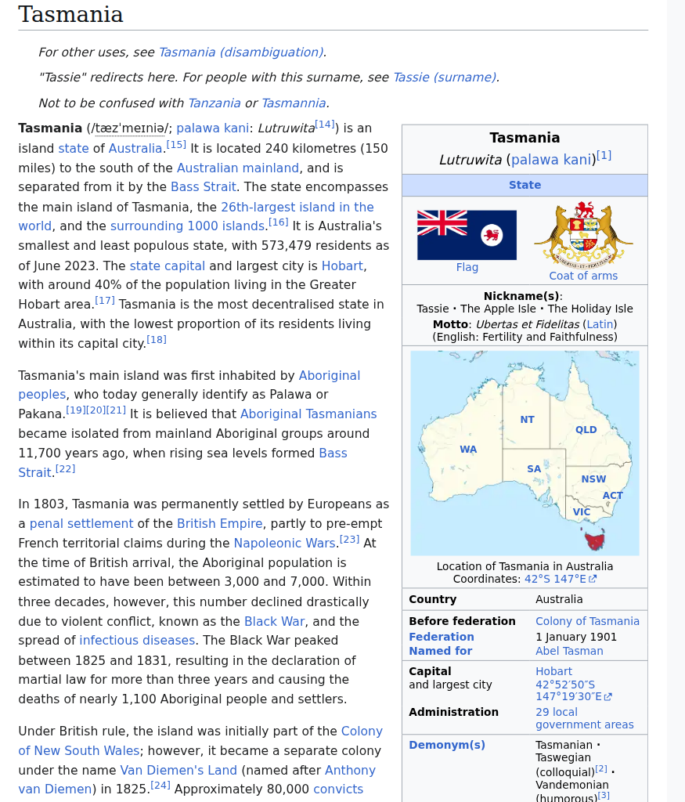

learning process and insights about PixelRAG

## PixelRAG

...

## API

### Text Query

**Input:**

```bash
curl -s -X POST https://pixelrag.ai/api/search \
  -H "Content-Type: application/json" \
  -d '{"queries": [{"text": "What is the capital of Tasmania?"}], "n_docs": 3}'
```

**Output:**

```json
{
    "results": [
        {
            "hits": [
                {
                    "score": 0.624868631362915,
                    "vector_id": 23310349,
                    "article_id": 7234200,
                    "tile_index": 0,
                    "chunk_index": 0,
                    "y_offset": 0,
                    "tile_height": 1024,
                    "path": "shard_873/shard_00002/7234200.png.tiles/chunk_0000_00.png",
                    "url": "Tasmania",
                    "article_pages": "0:0-7,1:0-7,2:0-7,3:0-7,4:0-7,5:0-6",
                    "image_base64": null
                },
                {
                    "score": 0.5778354406356812,
                    "vector_id": 9818959,
                    "article_id": 2938301,
                    "tile_index": 0,
                    "chunk_index": 0,
                    "y_offset": 0,
                    "tile_height": 1024,
                    "path": "shard_354/shard_00011/2938301.png.tiles/chunk_0000_00.png",
                    "url": "Geography_of_Tasmania",
                    "article_pages": "0:0-7,1:0-5",
                    "image_base64": null
                },
                {
                    "score": 0.5738669633865356,
                    "vector_id": 23310359,
                    "article_id": 7234200,
                    "tile_index": 1,
                    "chunk_index": 2,
                    "y_offset": 2048,
                    "tile_height": 1024,
                    "path": "shard_873/shard_00002/7234200.png.tiles/chunk_0001_02.png",
                    "url": "Tasmania",
                    "article_pages": "0:0-7,1:0-7,2:0-7,3:0-7,4:0-7,5:0-6",
                    "image_base64": null
                }
            ]
        }
    ]
}
```

The text query successfully retrieved [the correct Wikipedia article](https://en.wikipedia.org/wiki/Tasmania) as the top result with a score of 0.625.

### Fetching a Result Tile

**Input:**

```bash
curl -s https://pixelrag.ai/api/tile/7234200/0/0 --output result_tile_tasmania.png
```

**Output:**



The result is a PNG image file (875 x 1024 pixels) containing a screenshot tile of the Tasmania Wikipedia page. This confirms that the API returns actual rendered page screenshots as retrievable units.

### Image Query

**Input:**

```bash
curl -s -X POST https://pixelrag.ai/api/search \
  -H "Content-Type: application/json" \
  -d "{\"queries\": [{\"image\": \"$(base64 < tasmania.png | tr -d '\n')\"}], \"n_docs\": 3}"
```


**Output:**

```json
{
    "results": [
        {
            "hits": [
                {
                    "score": 0.5702254772186279,
                    "vector_id": 6649190,
                    "article_id": 1859601,
                    "tile_index": 0,
                    "chunk_index": 0,
                    "y_offset": 0,
                    "tile_height": 1024,
                    "path": "shard_224/shard_00002/1859601.png.tiles/chunk_0000_00.png",
                    "url": "Coat_of_arms_of_New_Zealand",
                    "article_pages": "0:0-4",
                    "image_base64": null
                },
                {
                    "score": 0.5504581928253174,
                    "vector_id": 9219754,
                    "article_id": 2736954,
                    "tile_index": 0,
                    "chunk_index": 0,
                    "y_offset": 0,
                    "tile_height": 1024,
                    "path": "shard_330/shard_00010/2736954.png.tiles/chunk_0000_00.png",
                    "url": "Flag_of_the_British_Antarctic_Territory",
                    "article_pages": "0:0-3",
                    "image_base64": null
                },
                {
                    "score": 0.5503813028335571,
                    "vector_id": 17981114,
                    "article_id": 5357499,
                    "tile_index": 0,
                    "chunk_index": 0,
                    "y_offset": 0,
                    "tile_height": 1024,
                    "path": "shard_646/shard_00006/5357499.png.tiles/chunk_0000_00.png",
                    "url": "National_symbols_of_Singapore",
                    "article_pages": "0:0-3",
                    "image_base64": null
                }
            ]
        }
    ]
}
```

The image query did not return the Tasmania article. Instead, it retrieved visually similar heraldic symbols.


## PixelRAG build index

### bug report

version of PixelRAG: 0.3.0
Symptom: ValueError: invalid literal for int() with base 10
Affected module: pixelrag_index.pipelines
Trigger: Using source.type: local with files whose stems are not valid integers

Root cause
1. LocalSource uses the raw file stem as the document ID
```python
# pixelrag_index/sources/local.py:30-41
            if ftype == "web":
                yield Document(
                    id=f.stem,
                    url=f"file://{f.resolve()}",
                    metadata={"type": ftype},
                )
            else:
                yield Document(
                    id=f.stem,
                    path=str(f),
                    metadata={"type": ftype},
                )
```

2. build() assumes every document ID is an integer
```python
# pixelrag_index/pipelines.py:103-106
    max_idx = max(int(a["id"]) for a in articles) + 1 if articles else 0
    article_entries = [{"title": "", "url": ""}] * max_idx
    for a in articles:
        idx = int(a["id"])
```

### code

```python
import shutil
from pathlib import Path

from pixelrag_index.pipelines import build


def _stage_source(source_path: Path, staging_dir: Path) -> Path:
    """Copy files from source_path into a subdir of staging_dir with integer names."""
    stage = staging_dir / source_path.name
    if stage.exists():
        shutil.rmtree(stage)
    stage.mkdir(parents=True, exist_ok=True)

    files = sorted(f for f in source_path.rglob("*") if f.is_file())
    for i, f in enumerate(files):
        dest = stage / f"{i:04d}{f.suffix}"
        shutil.copy2(f, dest)
        print(f"  Staged {f.name} -> {dest.name}")

    return stage


def build_index(
    source_path: Path,
    output_path: Path,
    *,
    model: str = "Qwen/Qwen3-VL-Embedding-2B",
    device: str = "cpu",
    stage: bool = False,
    staging_dir: Path | None = None,
) -> dict:
    """Build a PixelRAG index for a single source folder.

    Args:
        source_path: Path to the folder containing source documents.
        output_path: Path where the built index should be written.
        model: HuggingFace model name for embeddings.
        device: Device to run embeddings on.
        stage: If True, temporarily copy files to a staging directory with
            integer names before indexing, then clean up afterwards.
        staging_dir: Parent directory for temporary staging. Required if
            stage=True.

    Returns:
        Dict with 'status' ('ok' or 'error') and either 'output' or 'error'.
    """
    if not source_path.exists():
        return {"status": "error", "error": f"Source not found: {source_path}"}

    if stage:
        if staging_dir is None:
            raise ValueError("staging_dir is required when stage=True")
        build_source = _stage_source(source_path, staging_dir)
    else:
        build_source = source_path

    print(f"\n{'=' * 60}")
    print(f"Building index for: {source_path.name}")
    print(f"  Source : {build_source}")
    print(f"  Output : {output_path}")
    print(f"{'=' * 60}\n")

    config = {
        "source": {
            "type": "local",
            "path": str(build_source),
        },
        "embed": {
            "model": model,
            "device": device,
        },
        "output": str(output_path),
    }

    try:
        build(config, force=True)
        result = {"status": "ok", "output": str(output_path)}
    except Exception as e:
        print(f"ERROR building index for {source_path.name}: {e}")
        result = {"status": "error", "error": str(e)}
    finally:
        if stage and staging_dir is not None:
            stage_path = staging_dir / source_path.name
            if stage_path.exists():
                shutil.rmtree(stage_path)
                print(f"  Cleaned up staging dir: {stage_path}")

    return result
```

### concepts and logics

PixelRAG's pipeline has four stages: **render -> chunk -> embed -> index**. The relationship between tiles, chunks, and vectors depends on the document type.

#### For HTML / Web Pages

1. **Render**: A headless browser captures the page as screenshot tiles. Each tile is a vertical strip up to **8192 px tall** at the browser's **viewport width of 875 px**.
2. **Chunk**: The chunking stage splits tall tiles into smaller pieces the embedding model can ingest. The model expects images around 1024 px tall, so each tile is sliced into **1024 px horizontal strips** (with tiny tails < 28 px merged into the previous strip).
3. **Embed**: Each chunk becomes one vector.

#### For PDFs

1. **Render**: `pdf2image` (poppler) renders each PDF page to a JPEG at **200 DPI**. Each page becomes its own tile.
2. **Chunk**: Each PDF page is treated as exactly one chunk because a page is considered a natural semantic unit.
3. **Embed**: Each page (page = tile = chunk) becomes one vector.

## Traditional RAG build index

taking screenshots is easy, while extracting and chunking text is tricky
note that we implement basic RAG here, and fancy tricks are not in the scope of this post

### parsing documents

we only take care of html and pdf in this post

#### html

we extract text and throw away other information, such as the position of text

```python
from pathlib import Path

from bs4 import BeautifulSoup


def parse_html_text_only(html_path: Path) -> str:
    """Extract plain text only, no structure preservation."""
    with open(html_path, "r", encoding="utf-8", errors="ignore") as f:
        soup = BeautifulSoup(f.read(), "html.parser")
    return soup.get_text(separator=" ", strip=True)
```

#### pdf

we use `pypdf` for simple text extraction

```python
from pathlib import Path

from pypdf import PdfReader


def parse_pdf_default(pdf_path: Path) -> str:
    """Extract text from PDF using pypdf."""
    reader = PdfReader(str(pdf_path))
    pages = []
    for page in reader.pages:
        text = page.extract_text()
        if text:
            pages.append(text)
    return "\n\n".join(pages)
```

MinerU API for pdf to markdown convertion

```python
import os
import io
import time
import zipfile
from pathlib import Path

import requests

MINERU_BASE_URL = "https://mineru.net/api/v4"


def _mineru_headers() -> dict:
    token = os.getenv("MINERU_API_KEY", "")
    return {
        "Content-Type": "application/json",
        "Authorization": f"Bearer {token}",
    }


def call_mineru_api(pdf_path: Path) -> str:
    """Upload a PDF to MinerU, wait for extraction, and return markdown text."""
    headers = _mineru_headers()

    # 1. Request upload URLs
    data = {
        "files": [{"name": pdf_path.name, "data_id": pdf_path.stem}],
        "model_version": "vlm",
    }
    resp = requests.post(
        f"{MINERU_BASE_URL}/file-urls/batch", headers=headers, json=data, timeout=30
    )
    resp.raise_for_status()
    result = resp.json()
    if result.get("code") != 0:
        raise RuntimeError(f"MinerU upload URL request failed: {result.get('msg')}")

    batch_id = result["data"]["batch_id"]
    urls = result["data"]["file_urls"]

    # 2. Upload file
    with open(pdf_path, "rb") as f:
        up_resp = requests.put(urls[0], data=f, timeout=60)
    up_resp.raise_for_status()

    # 3. Poll for results
    max_retries = 120
    for i in range(max_retries):
        time.sleep(3)
        res_resp = requests.get(
            f"{MINERU_BASE_URL}/extract-results/batch/{batch_id}",
            headers=headers,
            timeout=30,
        )
        res_resp.raise_for_status()
        res_data = res_resp.json()
        if res_data.get("code") != 0:
            raise RuntimeError(f"MinerU result fetch failed: {res_data.get('msg')}")

        # Actual API returns extract_result array with state/done
        items = res_data.get("data", {}).get("extract_result", [])
        if not items:
            continue
        state = items[0].get("state")
        if state == "done":
            zip_url = items[0].get("full_zip_url", "")
            if not zip_url:
                raise RuntimeError(f"MinerU result missing zip URL for {pdf_path.name}")
            # Download ZIP and extract full.md
            zip_resp = requests.get(zip_url, timeout=60)
            zip_resp.raise_for_status()
            with zipfile.ZipFile(io.BytesIO(zip_resp.content)) as zf:
                with zf.open("full.md") as md_file:
                    return md_file.read().decode("utf-8")
        elif state == "failed" or items[0].get("err_msg"):
            raise RuntimeError(
                f"MinerU extraction failed for {pdf_path.name}: {items[0].get('err_msg')}"
            )
        # else: pending / processing — keep polling

    raise TimeoutError(f"MinerU extraction timed out for {pdf_path.name}")


def parse_pdf_mineru(pdf_path: Path) -> str:
    """Wrapper with clearer error on auth failure."""
    try:
        return call_mineru_api(pdf_path)
    except requests.HTTPError as e:
        if e.response is not None and e.response.status_code == 401:
            raise RuntimeError(
                "MinerU API authentication failed (401). Please check your MINERU_API_KEY."
            ) from e
        raise
```

### chunking

we use langchain for simple chunking

```python
from langchain_text_splitters import RecursiveCharacterTextSplitter


def chunk_text(text: str, chunk_size: int = 512, chunk_overlap: int = 50) -> list[str]:
    splitter = RecursiveCharacterTextSplitter(
        chunk_size=chunk_size,
        chunk_overlap=chunk_overlap,
        length_function=len,
        is_separator_regex=False,
    )
    return splitter.split_text(text)
```

why this can be tricky?
- many embedding models have limited input length
- another reason why the chunk size cannot be too big is that we want the retrieved content to be precise; otherwise, we can just feed the whole content into LLMs and indexing becomes useless
- chunk overlap is to mitigate the issue that you may cut something in half, but a large overlap will cause redundent content and maybe the top 5 paragraphs you retrieve are overlapping against each other
- besides breaking continuous content, we may also break the structure; here we totally ignore this and the resulting markdown pieces could be bad

### embedding

...

## Benchmark

...

## Discussion

...