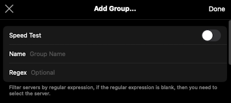
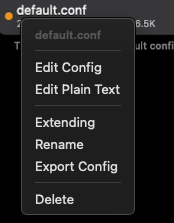
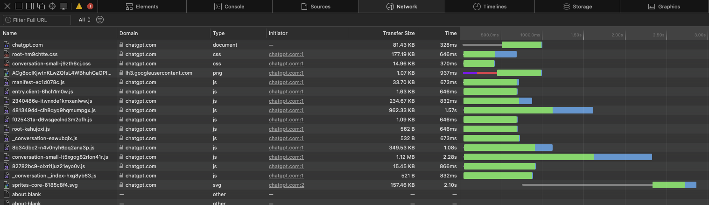
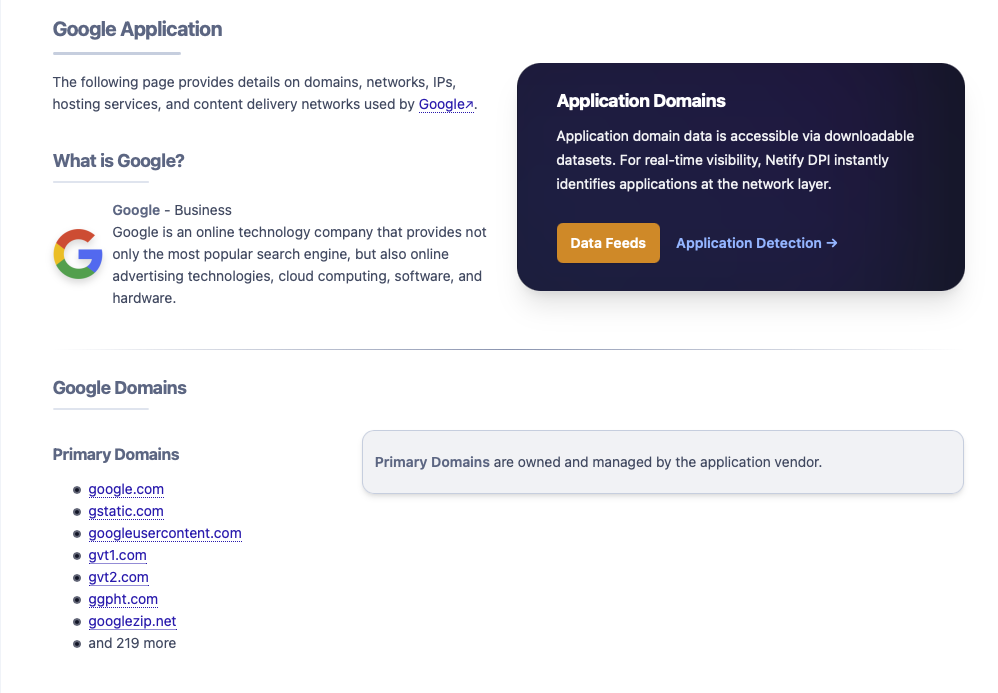
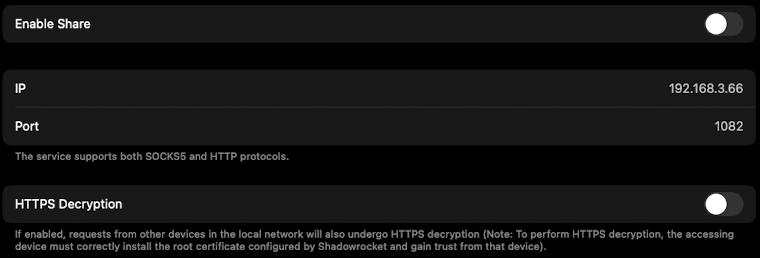
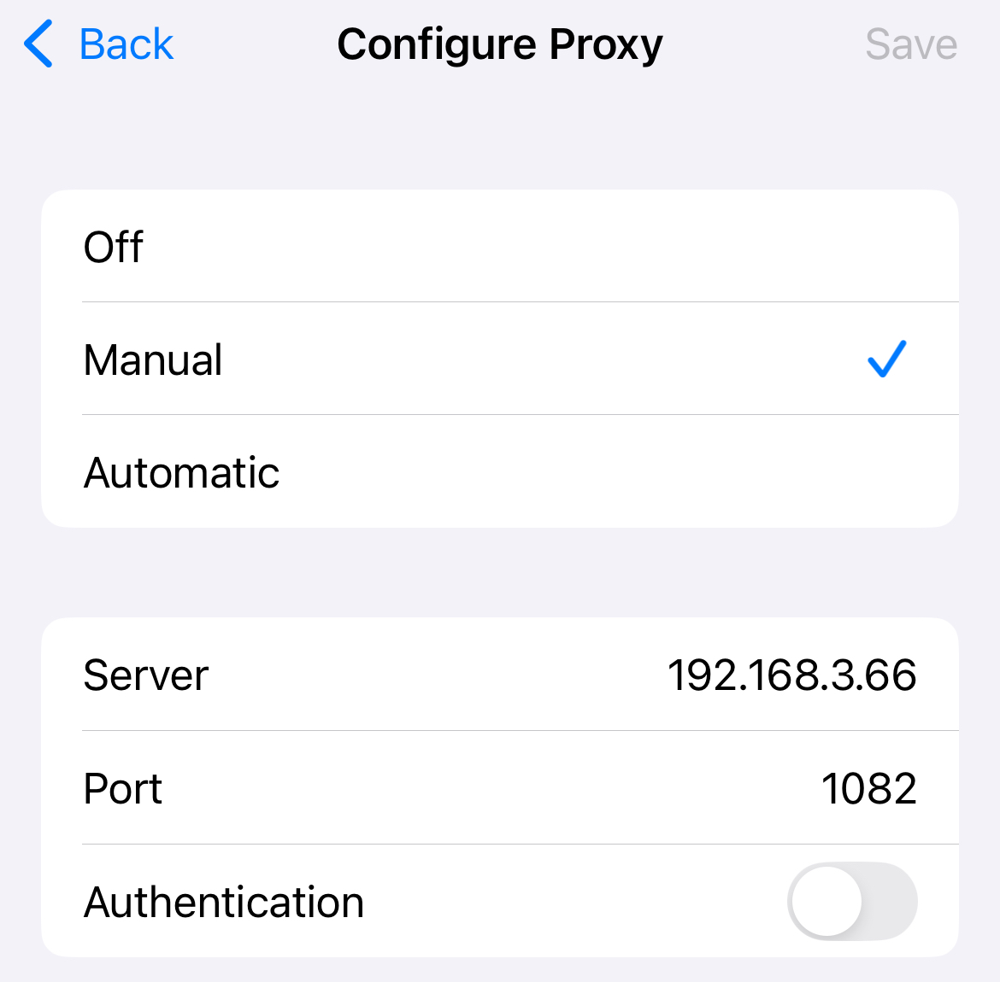

This guide covers how to set up a shared proxy for local devices using Shadowrocket (Version 2.2.80). Note that this post assumes you already have access to a VPN or proxy server, and it focuses on configuring and sharing that proxy across your devices.

## Overview

The setup consists of three main parts:
1. Creating server groups
2. Editing the configuration file
3. Sharing the proxy with other devices

---

## Part 1: Creating a Server Group

Groups allow you to organize your proxy servers and configure automatic server selection.

**To create a group:**

1. Go to **Home > Global Routing > Group** and click **Add Group**



2. Select servers for the group using either:
   - Regular expression matching
   - Manual selection

3. **Speed Test:**
   - **Enabled:** Shadowrocket will automatically select the best server from the group based on latency
   - **Disabled:** You can manually select a fixed server for this group

---

## Part 2: Editing the Configuration

### Understanding Configs

By default, Shadowrocket uses the **Config** routing mechanism at **Home > Global Routing**. To modify your routing rules:

1. Navigate to the **Config** tab
2. Note that `default.conf` is active by default
3. To add a new config, tap the **+** button in the top-right corner, and you can enter a URL to download a config file (e.g., from [GitHub](https://raw.githubusercontent.com/dlisin/shadowrocket-config/master/shadowrocket.conf))

### Editing a Config

You can edit a configuration in two ways:

1. Right click a config file
2. Choose either **Edit Plain Text** or **Edit Config**



### Example: Whitelist Configuration

Here's a typical whitelist configuration in plain text format:

```text
[General]
# copied from default.conf
bypass-system = true
skip-proxy = 192.168.0.0/16, 10.0.0.0/8, 172.16.0.0/12, localhost, *.local, captive.apple.com
tun-excluded-routes = 10.0.0.0/8, 100.64.0.0/10, 127.0.0.0/8, 169.254.0.0/16, 172.16.0.0/12, 192.0.0.0/24, 192.0.2.0/24, 192.88.99.0/24, 192.168.0.0/16, 198.51.100.0/24, 203.0.113.0/24, 224.0.0.0/4, 255.255.255.255/32, 239.255.255.250/32
dns-server = system
fallback-dns-server = system
dns-direct-system = false
dns-direct-fallback-proxy = false
use-local-host-item-for-proxy = false
ipv6 = true
prefer-ipv6 = false
icmp-auto-reply = true
always-reject-url-rewrite = false
private-ip-answer = true
udp-policy-not-supported-behaviour = REJECT

[Rule]
# domain suffix, use the selected server
DOMAIN-SUFFIX,steampowered.com,PROXY
# domain keyword, use the selected server from a group called GroupA
DOMAIN-KEYWORD,google,GroupA
# full domain, use the selected server from a group called GroupB
DOMAIN,browser-intake-datadoghq.com,GroupB
# direct connection by default
FINAL,DIRECT

[Host]
localhost = 127.0.0.1
```

### Finding Domains for Rules

To add custom rules, you'll need to know the domains your apps or websites use. Here are four methods:

**Method 1: Browser Developer Tools**

Open your browser's developer tools and inspect the Network tab to see request domains:



**Method 2: Online Resources**

Use websites like [Netify](https://www.netify.ai/resources/applications) to look up domains associated with specific services:



**Method 3: Community Databases**

Check GitHub repositories like [v2fly/domain-list-community](https://github.com/v2fly/domain-list-community) for curated domain lists.

**Method 4: LLMs**

Ask LLMs for help.

---

## Part 3: Sharing the Proxy

Once Shadowrocket is configured, you can share the proxy with other devices on the same network.

**To enable proxy sharing:**

1. Go to **Settings > Proxy > Proxy Share**
2. Tap **Enable Share**



**To connect from another device:**

On a device connected to the same WiFi network, configure the proxy in the WiFi settings using the IP address and port shown in Shadowrocket:



---

## Summary

With these three components—server groups for organization, custom configs for routing rules, and proxy sharing for local devices—you can build a flexible proxy setup that works across all your devices on your home network.